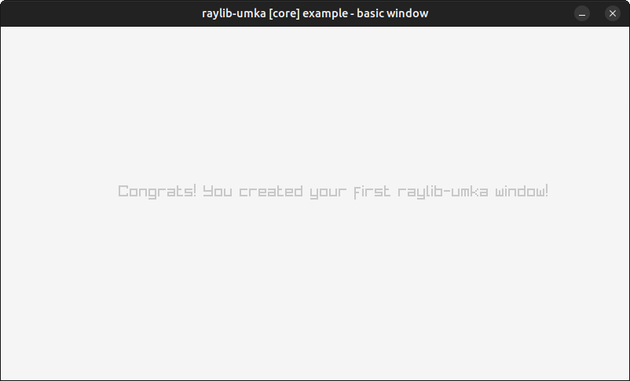

[](https://robloach.github.io/raylib-umka/)

# raylib-umka

[Umka](https://github.com/vtereshkov/umka-lang) scripting language bindings for [raylib](https://github.com/raysan5/raylib), a simple and easy-to-use library to enjoy videogames programming.

> [Go to Playground](https://robloach.github.io/raylib-umka/)

## Example

``` umka
import "raylib"

fn main() {
    screenWidth := 800
    screenHeight := 450

    raylib.InitWindow(screenWidth, screenHeight, "Hello World!")

    raylib.SetTargetFPS(60)

    for !raylib.WindowShouldClose() {

        raylib.BeginDrawing()

        raylib.ClearBackground(raylib.RAYWHITE)

        raylib.DrawText("Congrats! You created your first raylib-umka window!", 150, 200, 20, raylib.LIGHTGRAY)

        raylib.EndDrawing()
    }
    raylib.CloseWindow()
}
```

``` bash
raylib-umka core_basic_window.um
```

[](examples/core/core_basic_window.um)

## Features

- [x] raylib
- [x] raymath
- [ ] raygui
- [ ] reasings
- [ ] rlgl

## Development

Some information about how to compile the Umka bindings.

### API

To integrate the raylib Umka module into your own Umka instance...

``` c
#define RAYLIB_UMKA_IMPLEMENTATION
#include "raylib-umka.h"

// ...

umkaAddRaylib(umka);
```

### Generator

The [raylib-umka.h](include/raylib-umka.h) file is generated automatically via [Node.js](https://nodejs.org):

``` bash
npm it
```

### Compiling

While raylib-umka uses CMake, it could be used in other build systems.

#### Desktop
``` bash
mkdir build
cd build
cmake ..
make
make test
./bin/raylib-umka ../examples/core/core_basic_window.um
```

#### Web

``` bash
mkdir build
cd build
emcmake cmake .. -DPLATFORM=Web -DCMAKE_BUILD_TYPE=Release
emmake make
```

## License

*raylib-umka* is licensed under an unmodified zlib/libpng license, which is an OSI-certified, BSD-like license that allows static linking with closed source software. Check [LICENSE](LICENSE) for further details.
